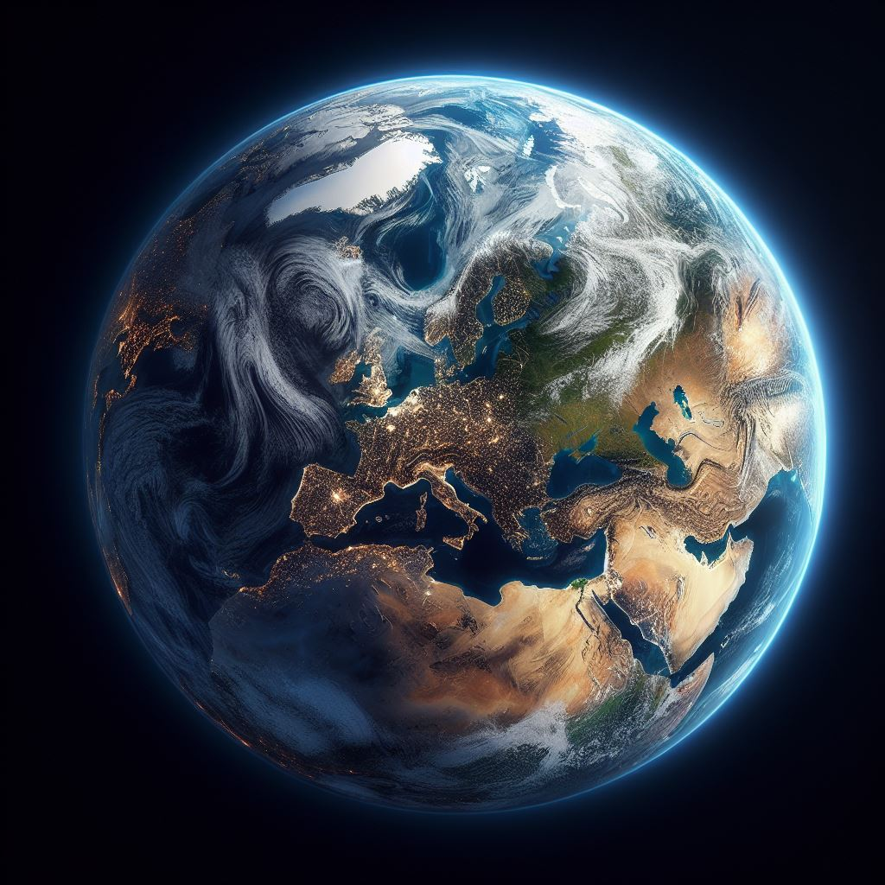

Il nostro pianeta! La Terra ha acqua liquida, atmosfera respirabile e una grande rietà di ecosistemi. È l'unico pianeta con vita conosciuta.

## Confronto con Venere

Venere è simile alla Terra per dimensioni e massa, ma presenta notevoli differenze nell’atmosfera e nel clima.

