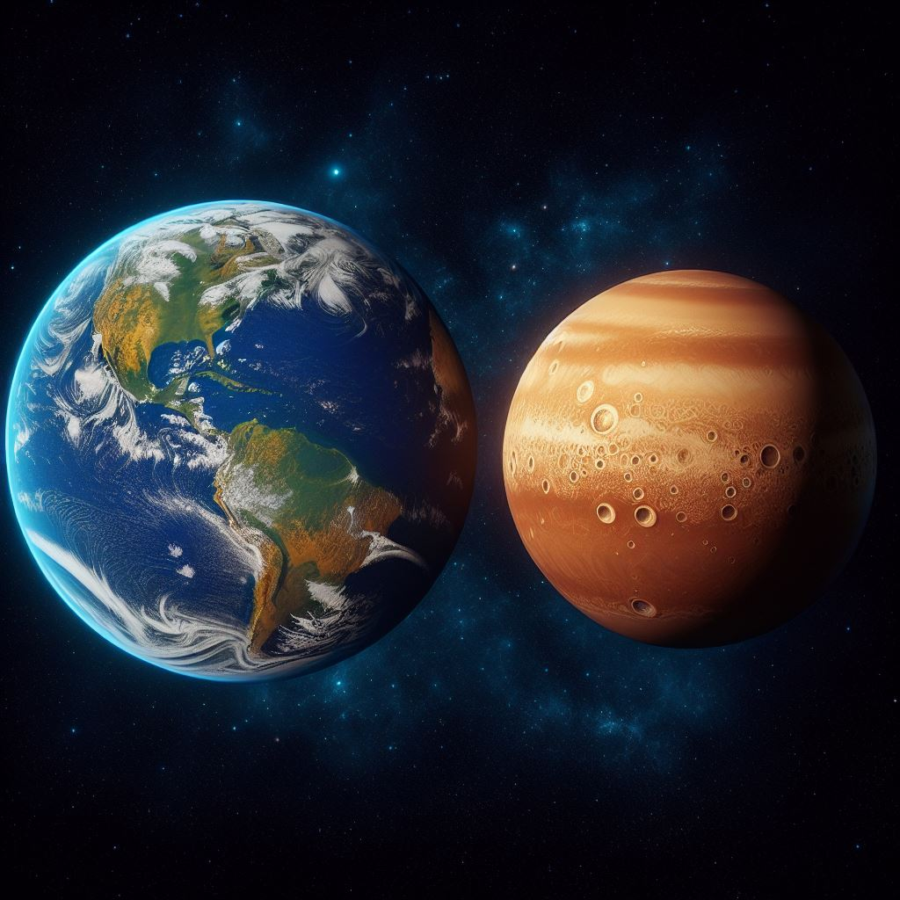

Venere è conosciuto come il "gemello della Terra" a causa delle sue dimensioni simili. La sua atmosfera densa è dominata da anidride carbonica, causando un effetto serra estremo.

## Confronto con la Terra

Ecco alcune somiglianze e differenze tra Venere e la Terra:

1. **Dimensioni e Massa**:
   - Venere è leggermente più piccola della Terra, con un diametro che equivale a circa il **95%** di quello terrestre ⁵.
   - La sua massa è circa l'**81%** di quella della Terra ⁵.

2. **Orbita e Periodo**:
   - Venere compie una rivoluzione attorno al Sole in **225 giorni terrestri** ⁴.
   - Un anno venusiano è più breve di uno terrestre e dura solo **224,7 giorni** ³.

3. **Atmosfera**:
   - L'atmosfera di Venere è principalmente composta da **anidride carbonica** ed è molto più densa di quella terrestre, con una pressione al livello del suolo pari a **92 atm** ⁴.
   - Questa densità e composizione creano un **effetto serra** che rende Venere il pianeta più caldo del sistema solare ⁴.

4. **Visibilità**:
   - Venere è il pianeta più luminoso nel cielo notturno dopo la Luna e può essere visto poco dopo il tramonto o poco prima dell'alba ⁴.
   - Spesso è stato chiamato dagli antichi Greci "stella della sera" o "stella del mattino" ⁴.

